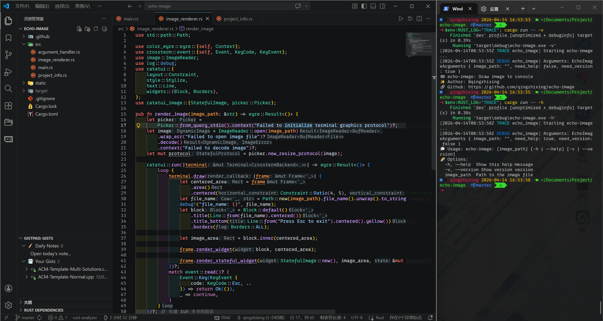
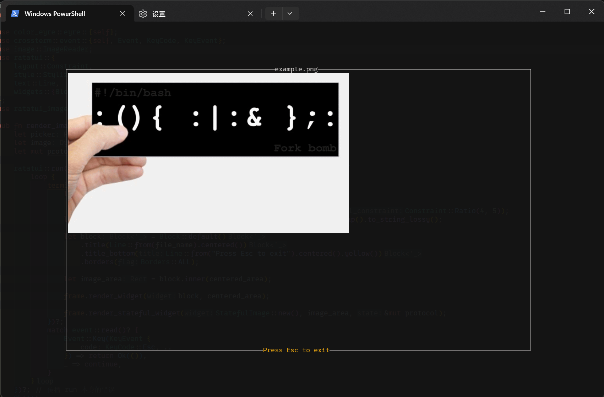

# 🏁 echo-image

View single image in terminal.


## ✨ Build

```shell
cargo build --release
```

## 🔄 Run

```shell
./target/release/echo-image <image_path> [-h | --help] [-v | --version]
```

## 🚀 Preview


